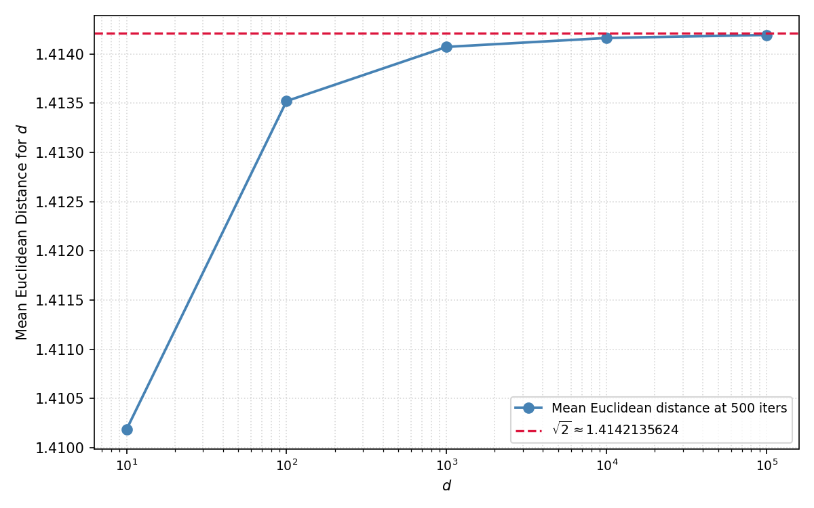

Consider two unit vectors $X,Y \in \mathbb{R}^d$. Let $X$ and $Y$ be independently and uniformly distributed on the unit hypersphere. That is, $X, Y \overset{\text{i.i.d}}{\sim} \text{Unif}(\mathbb{S}^{d-1})$. We hope to determine the expectation $\mathbb{E} [\lVert X-Y \rVert]$. In particular, we will find that it is difficult to compute the expectation for a specific choice of $d$. However, as $d \to \infty$, the expectation monotonically approaches a constant from below. We will determine the value of this constant. 

Since $\lVert X \rVert = \lVert Y \rVert = 1$, see that 
$$
\lVert X-Y \rVert = \sqrt{2 - 2 (X \cdot Y)} = \sqrt{2} \sqrt{(1 - (X \cdot Y))}.
$$

<!-- $(1 - (X \cdot Y))^{\frac{1}{2}}$ can be represented by the binomial series with the condition of convergence being $|X \cdot Y| < 1$. Since $X$ and $Y$ are both unit vectors, $|X \cdot Y| = |\cos(\theta_{X, Y})| \leq 1$. However, since $X$ and $Y$ are uniformly and randomally distributed, $\mathbb{P}(X=Y) = \mathbb{P}(X = - Y) = 0$. Thus, $\mathbb{P}(|X \cdot Y| < 1) =1$, and the series representation of$(1 - (X \cdot Y))^{\frac{1}{2}}$ always converges to the function. Expanding,  -->
<!-- $$ -->
<!-- \mathbb{E} [\lVert X-Y \rVert] = \sqrt{2} \left( \sum^\infty_{n=0} (-1)^n \binom{\frac{1}{2}}{n} \mathbb{E}[(X \cdot Y)^n] \right) -->
<!-- $$  -->
<!---->
<!-- Since $X$ and $Y$ are uniformly distributed vectors, $\mathbb{E} [X_k] = \mathbb{E} [Y_k] = \mathbb{E} [X \cdot Y] = 0$. Moving to the second order term, see that  -->
<!-- $$ -->
<!-- \mathbb{E}[(X \cdot Y)^2] =  \sum^d_{k=1} \sum^d_{j=1} \mathbb{E}[X_k Y_k X_j Y_j].  -->
<!-- $$ -->

<!-- Uniformity guantees that $\mathbb{E}[X_i^2] = \mathbb{E}[X_m^2]$ for all $i,m \in {1, 2, \dots, d}$ where $i \neq m$.  -->
<!---->
<!---->
<!-- We have shown that $\mathbb{E}[X \cdot Y] =0$ and $\mathbb{E}[(X \cdot Y)^2] = \frac{1}{d}$. It follows that  -->
It suffices to show that if $X \cdot Y \to 0$ as $d \to \infty$, then $\mathbb{E}[\lVert X-Y \rVert] \to \sqrt{2}$. $X \cdot Y$ is a scalar, so
$$
\text{Var}(X \cdot Y) = \mathbb{E}[(X \cdot Y)^2] - (\mathbb{E}[X \cdot Y])^2.
$$

Since $X$ and $Y$ are uniformly distributed, $\mathbb{E}[X_k] = \mathbb{E}[-X_k] = - \mathbb{E}[X_k]$ which implies that $\mathbb{E}[X_k] = \mathbb{E}[Y_k] = 0$. Thus, $\mathbb{E}[X \cdot Y] = \sum^d_{k=1} \mathbb{E}[X_k] \mathbb{E}[Y_k] = 0$. 

To handle $\mathbb{E}[(X \cdot Y)^2]$, first see that due to independence, $\mathbb{E}[X_k X_j Y_k Y_j] = \mathbb{E}[X_k X_j] \mathbb{E}[Y_k Y_j]$. Additionally, $\mathbb{E}[X_k X_j] = \mathbb{E}[(-X_k) X_j] = -\mathbb{E}[X_k X_j]$ implies that $\mathbb{E}[X_k X_j] = 0$ for $k \neq j$. $\lVert X \rVert = 1$, so 
$$
\sum^d_{k=1} \mathbb{E}[X_k^2] = d \mathbb{E}[X_k^2]  = 1 \Longrightarrow \mathbb{E}[X_k^2] = \frac{1}{d}.
$$

Expanding, 
$$
\mathbb{E}[(X \cdot Y)^2] = \sum^d_{k=1} \sum^d_{j=1} \mathbb{E} [X_k X_j] \mathbb{E}[Y_k Y_j].
$$

All terms where $k \neq j$ are $0$. Thus, when $k = j$, $\mathbb{E}[X_k X_j] = \mathbb{E}[X_k^2]$ and the sum simplifies to 
$$
\mathbb{E}[(X \cdot Y)^2] = \sum^d_{i=1} \left( \frac{1}{d} \right)^2 =  d \left( \frac{1}{d^2} \right) = \frac{1}{d}.
$$
It follows that $\text{Var}(X \cdot Y) = \frac{1}{d}$. 
Fixing some $\epsilon \in \mathbb{R}_{+}$, by Chebyshev's inequality, 
$$
\mathbb{P}(|(X \cdot Y) - \mathbb{E}[X \cdot Y]| \geq \epsilon) \leq \frac{\sigma^2}{\epsilon^2} = \frac{\text{Var}(X \cdot Y)}{\epsilon^2} = \frac{1}{d \epsilon^2} .
$$
See that by the squeeze theorem,

$$
0 \leq \lim_{d \to \infty} \mathbb{P}(|X \cdot Y| \geq \epsilon) \leq \lim_{d \to \infty} \frac{1}{d \epsilon^2} \Longrightarrow \mathbb{P}(|X \cdot Y| \geq \epsilon) = 0.
$$

Define $\lambda_d := X \cdot Y$. Recall that $\lVert X-Y \rVert = \sqrt{2 - 2 \lambda_d}$. Technically, $\lambda_d \in (-1,1)$ since $\mathbb{P}(X = Y) = \mathbb{P}(X = -Y) = 0$. However, for the purposes of this bound, we will say that $\lambda_d \in [-1,1]$ meaning $0 \leq \sqrt{2 - 2 \lambda_d} \leq 2$. We have shown that $\lambda_d \to 0$ as $d \to \infty$, so 
$$
\mathbb{E}[\sqrt{2 - 2 \lambda_d} - \sqrt{2}] \to 0,
$$
and we may conclude that
$$
\lim_{d \to \infty} \mathbb{E}[\lVert X-Y \rVert] = \sqrt{2}.
$$

The real conclusion here is a way of showing that in high dimensions, uniformly distributed unit vectors are almost always orthogonal, since if $X \perp Y$, then $\lVert X-Y \rVert = \sqrt{2}$.

There are, of course, much cleaner and more direct ways to do this proof, but they require much more intuition. I think this is a fairly mechanical but fun way to show this conclusion. I find it cool how this proof can be understood with only basic knowledge of linear algebra and probability, as even Chebyshev's inequality is not too difficult to prove. 

 In thinking about this problem, I found that one way to show that the sequence of expectations converges to $\sqrt{2}$ from below as $d \to \infty$ is to use the power series representation of $\mathbb{E}[\sqrt{1 - \lambda_d}]$ which is the expectation of the binomial series at $k = \frac{1}{2}$. It is fairly easy to show that all odd order terms are $0$, and all of the even order terms are negative (and approach $0$ as $d \to \infty$), meaning that for some $d \in \mathbb{N}$, $\sqrt{2} \mathbb{E}[\sqrt{1 - \lambda_d}] < \sqrt{2}$.

Below are the results of a simple Python simulation to show empirically the conclusion derived above. 

<em style="display:block;text-align:center;font-size:14px;color:#888;margin-bottom:1.5em;">Empirical distributions of $\lVert X - Y \rVert$ for $d \in \{10^1, 10^2, 10^3, 10^4, 10^5 \}$.</em>

*$\mathbb{E}[\lVert X - Y \rVert]$ over choices of $d$.*

Another cool observation is that the sequence defined by $a_d := \mathbb{E}[\lVert X-Y \rVert]$ is bounded, monotonic, and has the property $\lim_{d \to \infty} a_d = \sqrt{2} \notin \mathbb{Q}$. This is an example of the monotone convergence theorem in the wild, though I'm not sure what the further implications here are, if any. 
